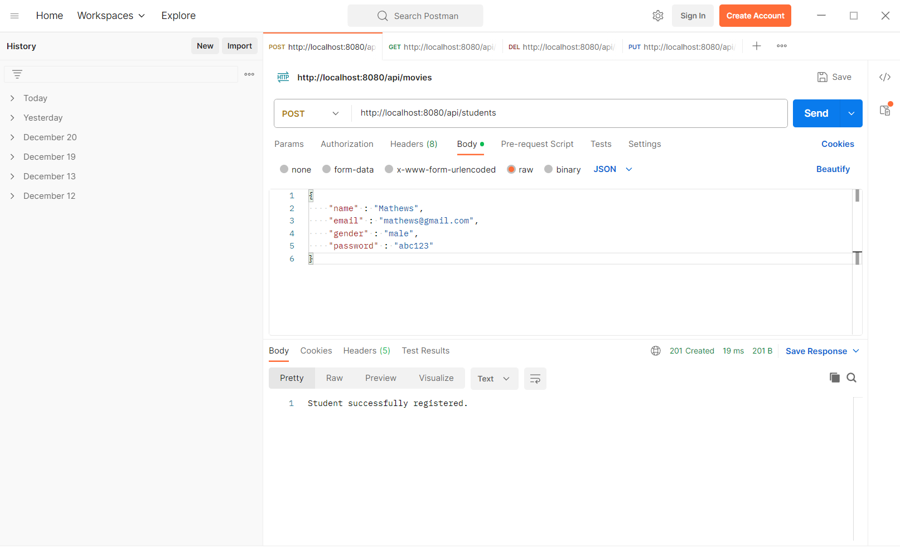
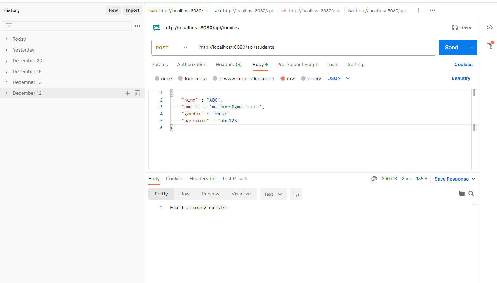
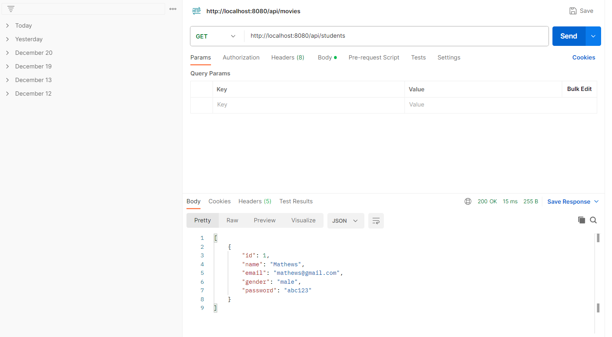
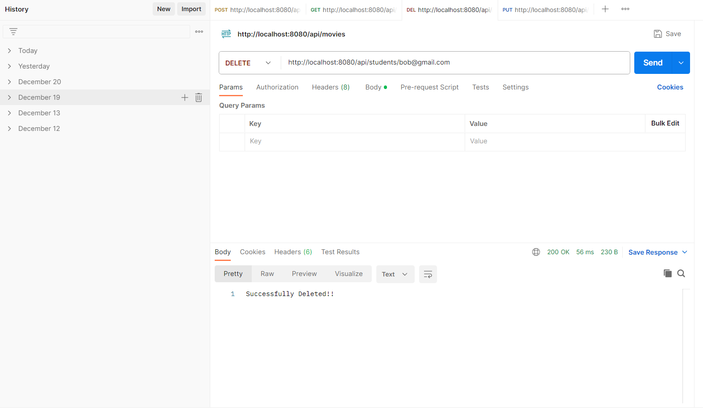
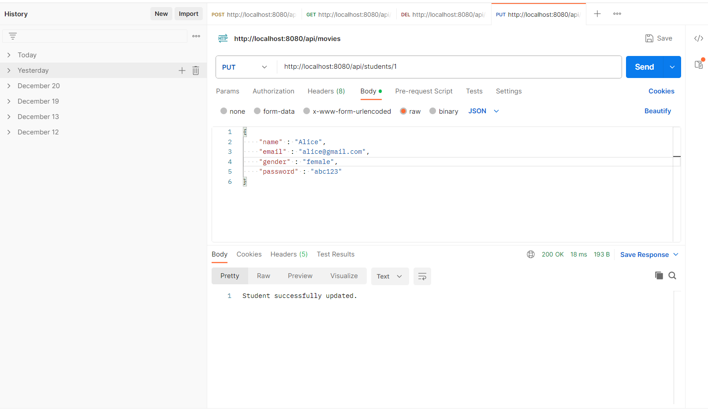

## Figure 1: Creating new Student profile

    

## Figure 2: Checking with already existing email

    

## Figure 3: Details of All Students

    

## Figure 4: Delete Student with email

    

## Figure 5: Updating Student details with id

    

## Figure 6: Checking the updation

    

